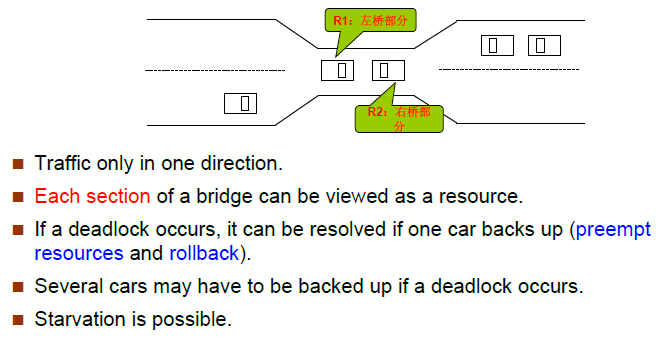
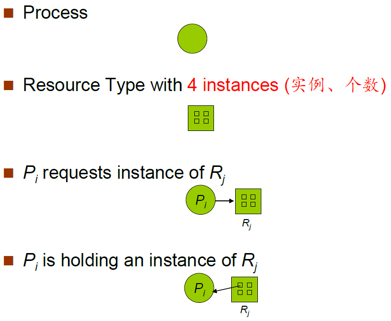
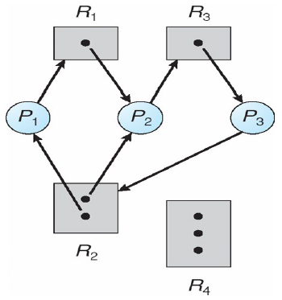
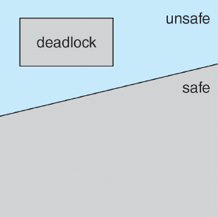
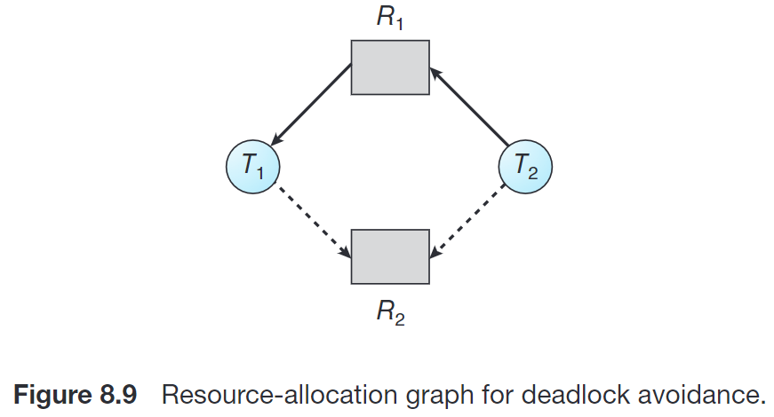
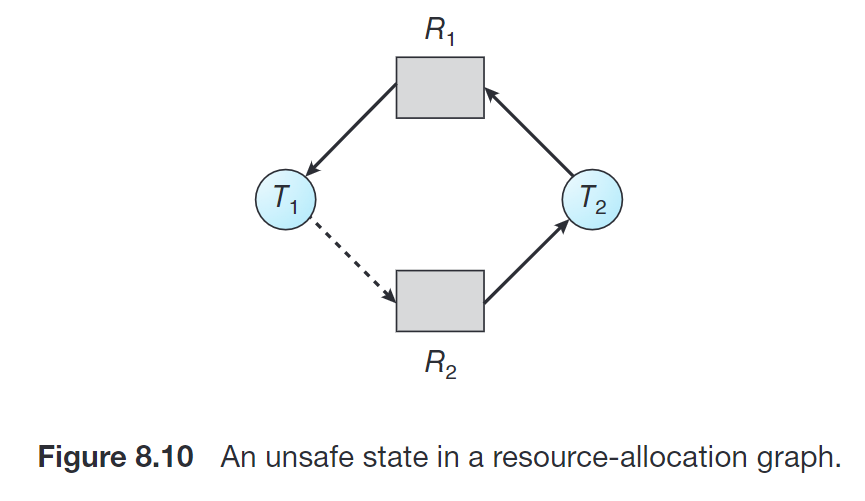

## Chap7 死锁

### 系统模型

{width=500}

#### 死锁问题

Deadlock ：A set of **blocked** processes each holding a resource and waiting to acquire a resource held by another process in the set.

死锁：指多个进程因竞争共享资源而造成**相互等待**的一种僵局，若无外力作用，这些进程都将永远不能再向前推进

#### 系统模型

资源类型 R1, R2, . . ., Rm，例如：
	CPU cycles, memory space, I/O devices
每种资源类型 Ri 有 Wi 个实例

每个进程都按以下几种方式运用资源：

- Request 申请
- Use 使用
- Release 释放

申请和释放为系统调用

### 死锁特性(Characterization)

#### 必要条件

如果以下条件同时满足，就可能引发死锁

- Mutual exclusion（互斥）: only one process at a time can use a resource. 资源的使用必须是互斥的，否则就不存在竞争关系，进程不会阻塞。
- Hold and wait（占有并等待、请求和保持）: a process holding at least one resource is waiting to acquire additional resources held by other processes. (请求和保持：进程已经保持了至少一个资源，但又提出了新的资源要求，而该资源又已被其它进程占有，此时请求进程阻塞，但又对已经获得的其它资源保持不放)

- No preemption（不可抢占、不剥夺）: a resource can be released only voluntarily by the process holding it, after that process has completed its task. 即被进程持有的资源只有在该进程完成其任务后才会被该进程自愿释放，其它进程不能抢占。
- Circular wait（循环等待）: there exists a set {P0, P1, …, Pn} of waiting processes such that P0 is waiting for a resource that is held by P1, P1is waiting for a resource that is held by P2, …, Pn–1 is waiting for a resource that is held by Pn, and Pn is waiting for a resource that is held by P0. 最终条件，相互等待，成环。

#### 资源分配图

G：点集V， 边集E

V由两种点构成：

- P = {P1, P2, ..., Pn}，系统(all)进程集合

- R = {R1, R2, ..., Rm}，系统(all)资源类型集合

E由两种有向边构成：

- 请求边(request edge) Pi -> Rj，进程Pi请求Rj类型的资源
- 分配边(assignment edge) Rj -> Pi，Rj类型的资源已被分配给进程Pi

图示如下：

{width=300}

资源分配图示例如下(存在死锁)：

{width=300}

##### 基本事实

**(死锁定理)**S为死锁状态的充分条件是：当且仅当S状态的资源分配图是不可完全简化的。

类比拓扑算法，资源就是进程的依赖项，拥有资源的进程可以完成工作并释放资源，并将该进程及其关联的边从图中删去，如果存在拓扑序列使得资源分配图最终完全简化成无进程空图，则不存在死锁。

### 处理死锁的策略

确保系统永远不会进入死锁状态：

- 死锁预防，死锁避免

允许系统进入死锁状态，然后从死锁状态恢复

- 死锁检测，死锁解除

**(鸵鸟方法)**忽视问题，假装系统中永远不会发生死锁，被大多数操作系统采用，如 UNIX、Linux、Windows

### 死锁预防(Prevention)

死锁预防的核心思路是，确保至少有一个必要条件永不成立，来保证系统不会出现死锁。针对四个条件分别进行预防：

#### 破坏互斥条件 

not required for sharable resources; must hold for nonsharable resources.

虚拟化：限制请求资源的方式

如果**把只能互斥访问的资源改造成共享的资源**，那么就不会发生死锁。比如SPOOLing技术。
举个例子，就比如说两个进程使用打印机的资源，在一个进程还没执行完的时候，另外一个进程是不能获取打印机的资源，只能阻塞。这就是互斥性，但是引入SPooling技术后，这时会出现第三个进程，叫做输入进程，进程1和进程2都将自己对打印机的请求交给输入进程，输入进程来决定什么时候让进程获取打印机资源，所以对于两个进程来说，自己的请求能够被立即接收并处理，不需要再阻塞等待。

缺点：并不是所有的资源都可以改造成可共享资源。并且为了系统安全，很多地方必须保护这种互斥性。因此很多时候无法破坏互斥条件。

#### 破坏请求和保持条件

must guarantee that whenever a process requests a resource, it does not hold any other resources

保证进程在申请资源时不能占有其他资源。

采用资源**静态**预分配方式：要求进程在开始运行前**一次性申请并获取所有需要的资源**，在资源能被满足前不让它投入运行，一旦开始运行**这些资源**就一直由它持有**直到运行结束**。或者只允许进程在不占有任何资源时申请资源(??? 感觉不靠谱，这样要是申请到一部分资源就永远运行不了了)。

缺点：**资源利用率低**，有些进程只需要某个资源很短的使用时间，如果一个进程在运行期间一直保持所有的资源不放，就会造成严重的资源浪费。同时有些进程的资源要求可能始终无法被满足，导致**饥饿**。

#### 破坏不可抢占条件

- If a process that is holding some resources requests another resource that cannot be immediately allocated to it, then all resources currently being held are released. 当一个进程申请的资源不能立即被分配给它时，强迫它释放当前占有的所有资源。即反正你短时间内还不能运行，就不要占用资源了。
- Preempted resources are added to the list of resources for which the process is waiting. 被抢占的资源将添加到该进程正在等待的资源列表中
- Process will be restarted only when it can regain its old resources, as well as the new ones that it is requesting.  只有当进程能够重新获得它的旧资源以及它所申请的新资源时，它才会重新启动。

#### 破坏循环等待条件

- impose a total ordering of all resource types, and require that each process requests resources in an increasing order of enumeration.
- F(tape drive)=1, F(disk drive)=5, F(printer)=12
- 资源的有序申请破坏了循环等待条件，即不可能成环了

破坏方法：给资源编号，必须按照编号从小到大的顺序申请资源
缺点：不方便增加新设备；如果加了新设备，编号可能需要重新编；会导致资源浪费；用户编程麻烦。

### 死锁避免(Avoidance)

要求系统有一些额外的可用的先验信息

>避免死锁需要一些额外信息，例如进程未来需要使用哪些资源、资源的使用顺序等。在每次请求到来时，即使对应资源可用，系统也应该结合现有可用资源、现有已分配资源以及各个进程未来申请和释放的资源，考虑是否让这个请求等待从而避免未来可能的死锁。
>
>不同模型可能对上述额外信息有不同的需求。最简单且最有用的模型维护这样的 **资源分配状态 (resource allocation state):**
>
>- 每个进程声明可能对每种资源类型的 **最大需求 (maximum demands)**
>- 当前系统的 available 和 allocated 的资源数目。

- Simplest and most useful model requires that each process declare the **maximum number of resources** of each type that it may need.
- The deadlock-avoidance algorithm **dynamically** examines the resource-allocation state to ensure that there can never be a circular-wait condition.
- **Resource-allocation state** is defined by the number of **available and allocated resources**, and the **maximum demands** **of the processes**

#### 安全状态

安全状态是指系统的一种状态，在此状态开始系统能按某种顺序（如P1、P2……Pn）来为各个进程分配其所需资源，直至最大需求，使**每个进程**都可顺序地一个个地完成。这个序列（P1、P2…….Pn）称为安全序列。若系统此状态不存在一个安全序列，则称系统处于不安全状态。自然，若存在一个安全序列，则处于安全状态。

Sequence <P1, P2, …, Pn> is safe(注意此编号序列并不是原进程的编号序列，有可能代表P2, P1, P3序列...) if for each Pi, the resources that Pi **can still request(还需要申请的)** can be satisfied by currently available resources + resources held by all the Pj, with j < i.

- If Pi resource needs are not immediately available, then Pi can wait until all Pj have finished.
- When Pj is finished, Pi can obtain needed resources, execute, return allocated resources, and terminate.
- When Pi terminates, P~i+1~can obtain its needed resources, and so on.

##### 基本事实

- If a system is in safe state ⇒ no deadlocks.
- If a system is in unsafe state ⇒ **possibility** of deadlock.
- Avoidance ⇒ ensure that a system will never enter an unsafe state.

​	

#### 资源分配图算法

每种资源只有单个实例

需求边(Claim edge) Pi→Rj indicated that process Pi may request resource Rj; represented by a **dashed line(- - ->)**.  表示进程 Pi 未来 **可能**会请求资源 Rj，用虚线表示。

Claim edge converts to request edge（请求边）when a process requests a resource.  当进程真正请求资源时，需求边转变为请求边，实线。

请求边(Request edge) converted to an assignment edge (分配边）when the resource is allocated to the process. 当资源被分配给进程时，请求边转变为分配边(反向)。

When a resource is released by a process, assignment edge reconverts to a claim edge. 当进程释放该资源时，分配边恢复为需求边。

Resources must be claimed a priori in the system(资源必须在系统中事先申请)

算法：假设进程Pi申请资源Rj。只有在需求边Pi→Rj变成分配边Rj→Pi 而不会导致资源分配图形成环(**要考虑需求边**)时，才允许申请。

用算法循环检测，如果没有环存在，那么资源分配会使系统处于安全状态。如果存在环，资源分配会使系统不安全。进程Pi必须等待。

举例：

{width=300}

{width=300}

R2分配给T2后成环了，不安全。

#### 银行家算法(Banker’s Algorithm)

每种资源有多个实例

Each process must a prior claim maximum use.
When a process requests a resource it may have to wait.
When a process gets all its resources it must return them in a finite amount of time.

数据结构

n个进程，m种资源

```c
Available[m]; // Available[j] = k, 还剩k个Rj类型的资源
Max[n][m]; // Max[i][j] = k, Pi最多请求(request)k个Rj类型的资源
Allocation[n][m]; // Allocation[i][j] = k, Pi目前被分配了k个Rj类型的资源
Need[n][m]; // Need[i][j] = Max[i][j] - Allocation[i][j] = k, Pi还需要k个Rj类型的资源
```

##### 安全(检测)算法

寻找安全序列，用 Work 和 Finish **模拟**分配过程。

依次分配(模拟)给能满足的，即Need ≤ Available(向量，即各种资源都满足)，使用完后回收分配的资源，此处是模拟过程，所以就直接回收资源

1. Let Work and Finish be vectors of length m and n, respectively. Initialize:
   Work = Available
   Finish [i] = false for i = 1,2,3, …, n.

2. Find an index i such that both:
   (a). Finish [i] = false // 还未完成
   (b). Needi ≤ Work    // 可以满足资源需求，则分配给它使用(此处省略分配过程)
   If **no such i exists**, go to step 4.

3. Work = Work + Allocationi  // 回收资源

   Finish[i] = true 					 // 此进程完成

   go to step 2.

4. If Finish [i] == true for **all i**, then the system is in a safe state. // 若所有进程都完成，则存在安全序列，系统处于安全状态，否则处于不安全状态

如果i能执行，那下一次检测默认从i + 1开始，视作循环队列

>操作数量级：m\*n\*n

##### 资源请求算法

**Requesti** = request vector for process Pi. If Requesti[j] = k then process Pi wants k instances of resource type Rj. **Requesti** 是动态发出的资源请求，而**Available**，**Allocationi**，**Needi** 等是当前的状态

1. If Requesti ≤ Needi go to step 2. Otherwise, raise error condition, since process has exceeded its maximum claim.
2. If Requesti ≤ Available, go to step 3. Otherwise Pi must wait, since resources are not available.
3. **Pretend** to allocate requested resources to Pi by modifying the state as follows(先假装分配给你，然后检测一下这样分配是否安全): 
   **Available** = Available - Requesti;
   **Allocationi**= Allocationi + Requesti;
   **Needi** = Needi – Requesti;
   - Call Safety Algorithm
   - If safe ⇒the resources are allocated to Pi.
   - If unsafe ⇒Pi must wait, and the old resource-allocation state is restored

>银行家算法的考点基本就是两个
>
>1. 已知进程和资源状态，问是否处于安全状态，或求安全序列。此时使用安全检测算法即可。
>
>2. 已知进程和资源状态，来了一个新的 Requesti，问能否立即满足此请求。此时使用资源请求算法，即先假装满足该请求并修改资源状态，再用安全检测算法检测是否仍处于安全状态，若安全，则可以立即满足。

### 死锁检测(Detection)

Allow system to enter deadlock state，检测到后恢复
Detection algorithm
Recovery scheme

#### 等待图

每种资源单实例

维护 wait-for fraph，将资源分配图转化成等待图

Nodes are processes.
Pi→Pj if Pi is waiting for Pj.

Periodically invoke an algorithm that **searches for a cycle** in the graph.

An algorithm to detect a cycle in a graph requires an order of **n^2^** operations, where n is the number of **vertices** in the graph.

当且仅当等待图中存在环，系统死锁。

#### 检测算法

每种资源多实例

数据结构

```c
Available[m]; // Available[j] = k, 有k个Rj类型的资源
Allocation[n][m]; // Allocation[i][j] = k, Pi目前被分配了k个Rj类型的资源
Request[n][m]; // Request[i][j] = k, Pi正在请求k个Rj类型的资源
```

1. Let Work and Finish be vectors of length m and n, respectively Initialize:
   (a) Work = Available
   (b) For i = 1,2, …, n, if Allocationi ≠ 0, then Finish[i] = false;otherwise, Finish[i] = true.(目前还没有被分配资源的，不参与，不会影响当前状态) **后续操作和安全算法一致**
2. Find an index i such that both:
   (a) Finish[i] == false
   (b) Requesti ≤ Work
   If no such i exists, go to step 4.
3. Work = Work + Allocationi 
   Finish[i] = true 
   go to step 2.
4. If Finish[i] == false, for some i, 1 ≤ i ≤ n, then the system is in deadlock state. Moreover, **if Finish[i] == false, then Pi is deadlocked.**

Algorithm requires an order of O(**m x n^2^**)operations to detect whether the system is in deadlocked state.

#### 检测算法的使用

When, and how often, to invoke depends on:

- How often a deadlock is likely to occur? 死锁发生频率
- How many processes will need to be rolled back? 死锁发生时需要回退的进程数

If detection algorithm is invoked arbitrarily, there may be many cycles in the resource graph and so we would not be able to tell which of the many deadlocked processes “caused” the deadlock. (如果任意/不确定地调用检测算法，那么资源图中可能会有很多循环，因此我们将无法判断是哪些死锁进程“导致”了死锁。)

### 死锁恢复(Recovery)

检测到死锁后采取措施：

- 通知系统管理员
- 系统自己恢复

打破死锁两种方法：

- 进程终止
- 抢占资源

#### 进程终止

- 终止所有处于死锁状态的进程
- 每次终止一个进程，直至死锁环被解除

决定哪个进程被终止时可能考虑的因素:

- 进程优先级
- 进程已经计算了多长事件，还需要多长时间才能完成
- 进程已经使用的资源
- 进程还需要多少资源才能完成任务
- 需要终止多少进程
- 该过程是交互式(interactive)的还是批处理(batch)的

#### 资源抢占

- Selecting a victim –minimize cost 选择受害者，最小化代价
- Rollback（回退）–return to some safe state, restart process for that state. 回退到安全状态，但是很难，一般需要完全终止进程重新执行
- Starvation –same process may always be picked as victim, **include number of rollback in cost factor**. 可能导致饥饿，所以每次被回退后该进程的cost应增加，类似于aging
